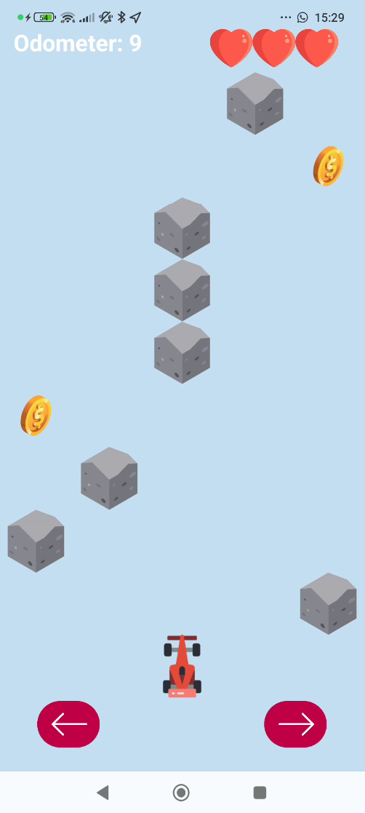

# Racecar VS Obstacles (2.0)

## Overview
Racecar VS Obstacles is a 2D racing game built in Android Studio using Java. Control your racecar to dodge obstacles that are constantly dropping from the road. The game features smooth gameplay, animated obstacles, collision detection, and a variety of new features to enhance the gaming experience.

## Features
- **Smooth Gameplay**: Enjoy a seamless gaming experience with responsive controls.
- **Animated Obstacles**: Dynamic and engaging obstacles that keep the game challenging.
- **Collision Detection**: Robust collision detection system using rectangles.
- **Endless Mode**: Obstacles are generated endlessly to keep the game going.
- **Game Icon**: A unique and attractive game icon.
- **Tilting Controls**: Move left and right using the accelerometer sensor.
- **Wider and Longer Road**: Expanded road for more challenging gameplay.
- **Crash Sound**: Realistic crash sound effects upon impact.
- **Coins**: Collect coins on the road to boost your score.
- **Odometer**: Keep track of the distance traveled.
- **Menu Screen**: Includes buttons for Normal mode, Fast mode, Sensor mode, and High Scores.
- **High Scores Layout**: Manage high scores with two fragments - top 10 highest scores and player locations on Google Maps.

## Screenshots





## Getting Started

### Prerequisites
- Android Studio
- Java Development Kit (JDK)

### Installation
1. Clone the repository:
    ```bash
    git clone https://github.com/natikozel/Android_racecar.git
    ```
2. Open the project in Android Studio.
3. Build the project to download necessary dependencies.

### Running the Game
1. Connect your Android device or start an emulator.
2. Click on the `Run` button in Android Studio or use the following command:
    ```bash
    ./gradlew installDebug
    ```

## How to Play
- **Controls**: Use the left and right buttons on the screen or tilt your device to move the racecar.
- **Objective**: Avoid the obstacles falling from the top of the screen for as long as possible. Collect coins to boost your score and keep track of the distance with the odometer.

## Menu Options
- **Normal Mode**: Standard gameplay mode.
- **Fast Mode**: Increased speed for a more challenging experience.
- **Sensor Mode**: Use the device's accelerometer to control the racecar.
- **High Scores**: View the top 10 highest scores and their respective player locations on Google Maps.

## High Scores Layout
- **Top Scores Fragment**: Displays the top 10 highest scores ever created since the download of the game.
- **Google Maps Fragment**: Upon clicking any of the top 10 scores, the player's location is zoomed in on the map.

## Contributing
Contributions are welcome! Please fork the repository and submit a pull request for review.

## Acknowledgments
- Thanks to all the open-source projects and libraries that helped make this game possible.

## Contact
If you have any questions or feedback, feel free to contact me at [netanelkozel@gmail.com](mailto:netanelkozel@gmail.com)
